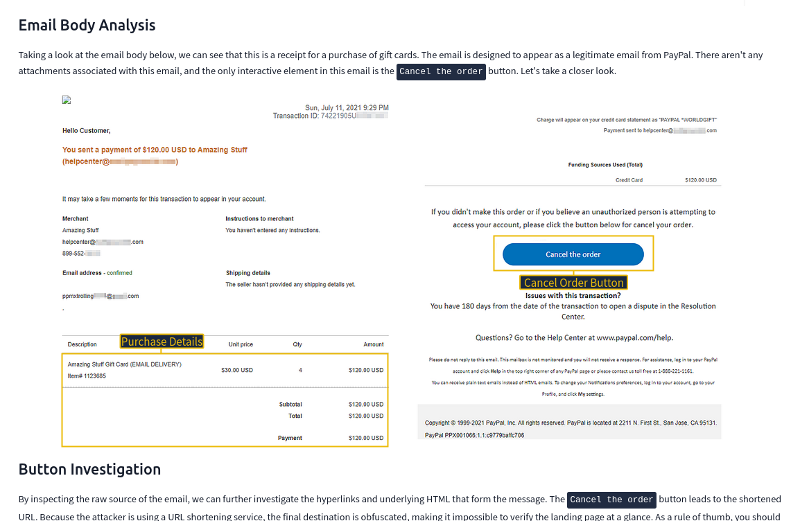
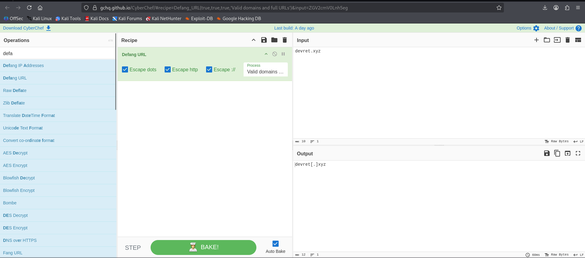
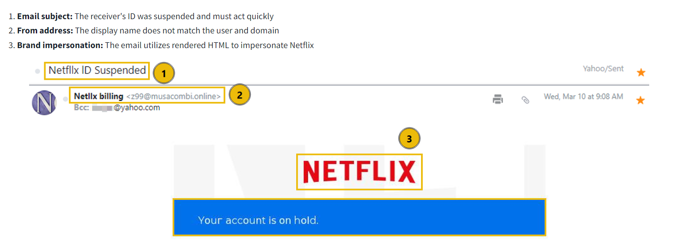
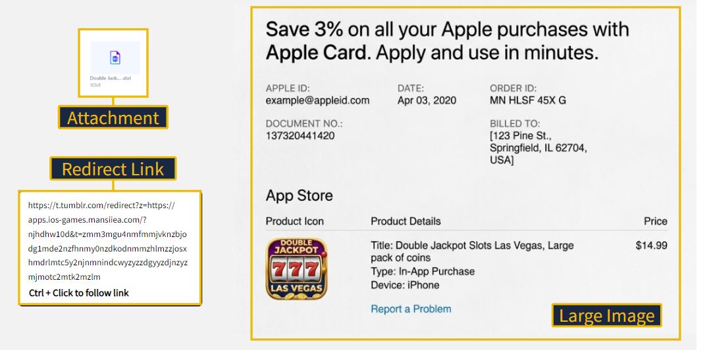
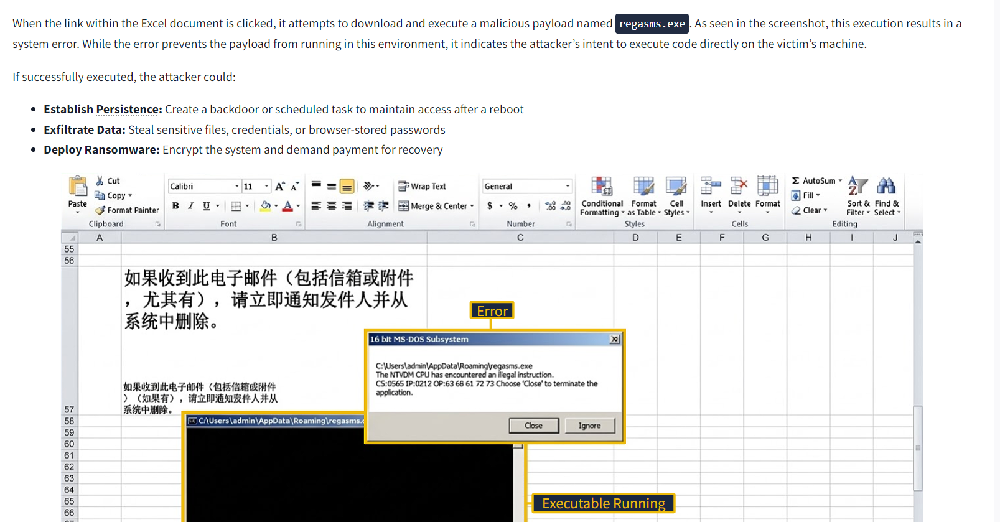

# TryHackMe: Phishing Emails in Action

## Task 2: Cancel Your Order

### Q1: Who is listed as the Merchant in the email body?

Answer: Amazing Stuff  
Explanation: Looking at the email receipt layout shown in the image above, the text on the left explicitly highlights "Merchant," with the value "Amazing Stuff" directly beneath it.

## Task 3: Track Your Package

### Q1: What root domain does the hyperlink in the above example point to? Be sure to defang the URL.

Answer: devret[.]xyz  
Explanation: As shown in the CyberChef interface in the image above, the target root domain devret.xyz was typed into the Input section, and the Defang URL recipe was executed to cleanly swap the dot out for square brackets in the Output block.

## Task 4: Download Document Here

### Q1: The attacker deployed a fake portal to capture and exfiltrate user credentials. What is this type of attack called?

Answer: Credential Harvesting  
Explanation: 

## Task 5: Your Account is on Hold

### Q1: What is the actual sender email address hidden behind the Netllx billing display name?

Answer: z99@musacombi.online  
Explanation: Looking at item 2 inside the highlighted header details in the image above, the true underlying sender address z99@musacombi.online is clearly displayed right next to the fake "Netllx billing" display name string.

## Task 6: Your Recent Purchase

### Q1: What does the acronym BCC stand for?

Answer: Blind Carbon Copy  
Explanation: This is a standard technical definition for email routing fields. It represents a hidden recipient distribution layer that allows a message to be carbon copied to an address without showing it to other parties.

### Q2: What is the file extension of the attachment?

Answer: .dot  
Explanation: Scanning the left-hand column inside the image above, the Attachment icon box labels the malicious file as Double Jack....dot, showcasing a Microsoft Word Template extension.

## Task 7: Scheduled Shipment

### Q1: What is the name of the executable that the Excel attachment attempts to run?

Answer: regasms.exe  
Explanation: Looking closely at the top explanatory context and the pop-up warning dialog box embedded inside the Excel workbook layout in the image above, the active execution string directly triggers a malicious payload process named regasms.exe.
